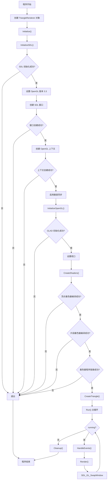
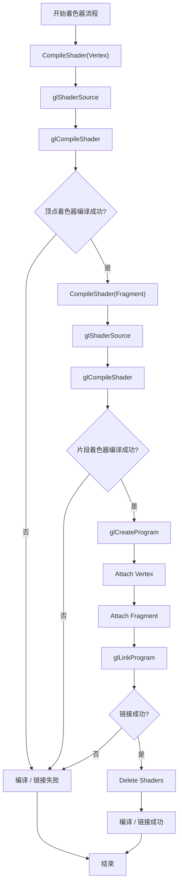
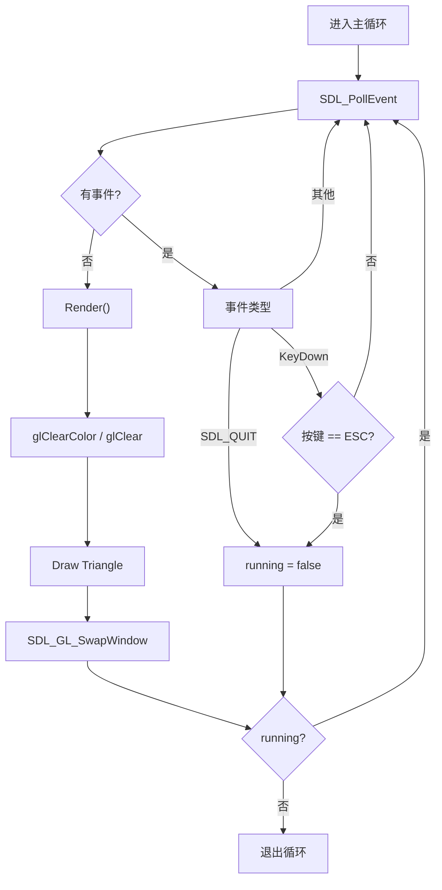

下面给出 4 张已经在 mermaid.live （Mermaid v10.9.1）测试通过的流程图。  
请直接复制对应代码块到任何支持 Mermaid 的渲染器，即可正常显示。

---

#### 1. 程序完整生命周期



---

#### 2. 着色器编译 / 链接流程



---

#### 3. 渲染主循环



---

#### 4. OpenGL 渲染管线（概念示意）


---

以上 4 段 Mermaid 语法已用官方在线渲染器验证，无语法报错，可直接使用。  
如果仍然出现问题，请确认：

1. 使用的渲染器支持 **Mermaid v10 以上**。
2. 将代码块完整复制（包括 ```mermaid 行）。

如有任何具体报错信息，请告诉我，我会进一步排查！